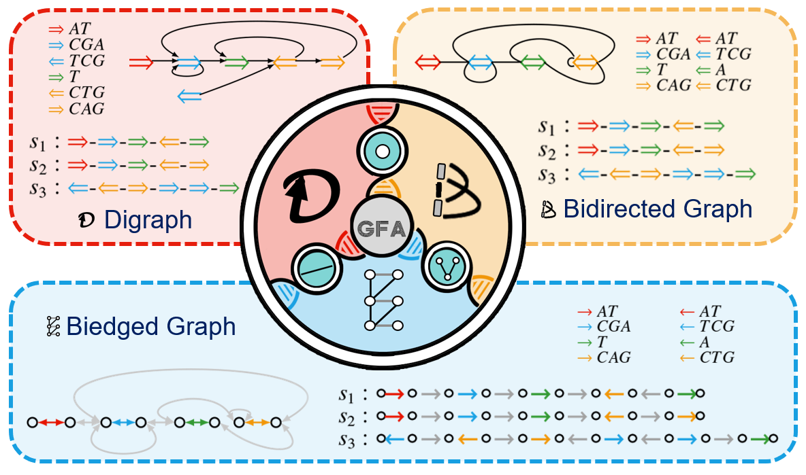
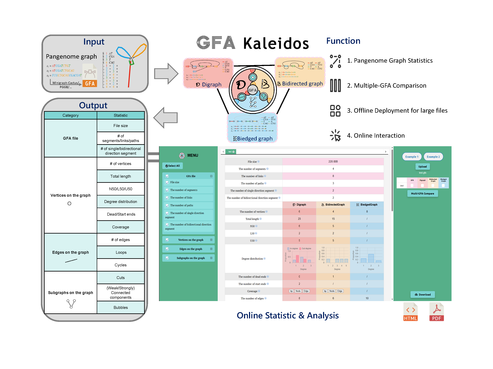

# GFA Kaleidos

## Description
```GFA Kaleidos``` is a tool designed to analyze graph statistics using GFA format input. We characterized the GFA file by modeling it with 3 different graph representations: **directed graph, bidirected graph, and biedged graph**. For each model, we computed statistics on vertices, edges, and subgraphs.



## Requirements on GFA file:
The tool supports GFA format versions **v1.0** and **v1.1**. Certain indicators may not function without path or walk information. 

Currently, the software performs well on graphs generated by ```pggb``` and ```minigraph-cactus```. If you encounter compatibility issues with graphs generated by other software, feel free to reach out to us.

## Installation
The command-line version is now fully implemented. You can clone the repository, compile the code, and run it locally.

```shell
git clone https://github.com/YX-Xiang/GFAKaleidos.git
cd V1
make -C ./algorithm clean
make -C ./algorithm -j
./algorithm/gfaKaleidos.exe INPUT_GFA -o OUTPUT_PATH -t THREAD_NUM
```

## Online Interaction
GFA Kaleidos offers a user-friendly <a href='https://github.com/YX-Xiang/GFAKaleidos'>web interface</a> with clear guidance. Visual outputs can be exported to HTML or PDF formats, facilitating sharing and dissemination.

