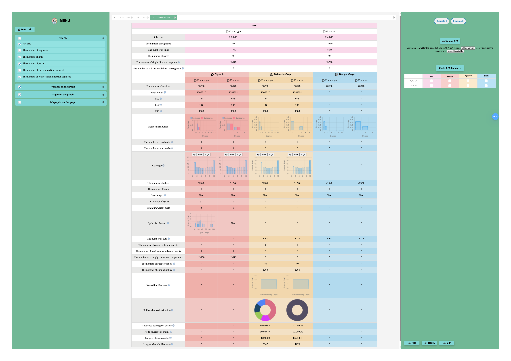

# GFA Kaleidos
1. [Description](#Description)
2. [Requirements on GFA file](#requirements-on-gfa-file)
3. [Installation](#Installation)
4. [Online Interaction (option)](#online-interaction-option)
5. [Examples](#Examples)
6. [Citations](#Citations)
7. [Acknowledgements](#Acknowledgements)

## Description
`GFA Kaleidos` is a tool designed to analyze graph statistics using GFA format input. We characterized the GFA file by modeling it with 3 different graph representations: **directed graph, bidirected graph, and biedged graph**. For each model, we computed statistics on vertices, edges, and subgraphs.


## Requirements on GFA file
The tool supports GFA format versions **v1.0** and **v1.1**. Certain indicators may not function without path or walk information. 

Currently, the software performs well on graphs generated by `pggb` and `minigraph-cactus`. If you encounter compatibility issues with graphs generated by other software, feel free to reach out to us.

## Installation
The command-line version is now fully implemented. You can clone the repository, compile the code, and run it locally.

```shell
git clone git@github.com:YX-Xiang/GFAKaleidos.git
cd GFAKaleidos/V1
make -C ./algorithm clean
make -C ./algorithm -j
./algorithm/gfaKaleidos.exe INPUT_GFA -o OUTPUT_PATH -t THREAD_NUM
zip ZIP_NAME.zip OUTPUT_PATH
```

1. `INPUT_GFA`: The file path of the GFA file that the user wants to analyze.

2. `OUTPUT_PATH`: The output directory path where the results will be saved. This should be a folder.

3. `THREAD_NUM`: The number of threads to use for the analysis. The default value is 1.

4. `ZIP_NAME`: The file path for the compressed output result in .zip format (optional). If further interaction with the website is required, this parameter must be specified.

## Online Interaction (option)
Upload ZIP_NAME.zip to <a href='https://combiopt.nankai.edu.cn/gfakaleidos'>web server</a>, which offers a user-friendly interface with clear guidance. Visual outputs can be exported to HTML or PDF formats, facilitating sharing and dissemination.


## Examples
### Getting Started
Here below a guide on how to generate the datasets used for the experiments presented in the GFA Kaleidos paper, generate the ***Drosophila melanogaster* pangenome** using the 2 different tools and run the analysis. The final datasets `01_dm_pggb.gfa` and `02_dm_mc.gfa` can be found in the <a href='https://github.com/YX-Xiang/GFAKaleidos/tree/main/example'>example</a> folder.

### Download
To download the haplotypes, you can go to <a href='https://www.ncbi.nlm.nih.gov/datasets/genome/?taxon=7227'>NCBI</a>. It is recommended to use the ```ncbi-genome-download``` command to batch download genomic data, accession numbers are provided in example/accessions.txt

```shell
ncbi-genome-download --assembly-accessions example/accessions.txt invertebrate --formats fasta --output-folder example/genome -s genbank --species-taxid 7227 --flat-output -P

cd example/genome
gunzip *.fna.gz
```

### Separation of Chromosomes
In this step, we isolated chromosome 4 in the *Drosophila* assembly. You can run `python ../scripts/separation.py` directly.

```python
# separation.py
import os

def process_fna(fna_path):
    with open(fna_path, 'r') as fna:
        sequences = fna.read().split('>')
        for sequence in sequences:
            if not sequence.strip():
                continue

            sequence_parts = sequence.split('\n', 1)
            header = sequence_parts[0].split(' ')
            chromosome = header[6]
            if chromosome == '4':
                sequence_data = ''.join(sequence_parts[1:]).strip()
                parts = os.path.basename(fna_path).split('_')
                new_file_name = parts[0] + '_' + parts[1] + '_' + chromosome + '.fa'
                new_file_path = os.path.join(os.path.dirname(fna_path), new_file_name)
                with open(new_file_path, 'w') as new_file:
                    new_file.write('>' + sequence_parts[0].strip() + '\n' + sequence_data)

current_directory = os.getcwd()
for file in os.listdir(current_directory):
    if file.endswith(".fna"):
        process_fna(os.path.join(current_directory, file))
```

After this, you will get 10 files with names like `GCA_029775XXX_4.fa`

### Pangenome Generation
#### PGGB
First, ensure you have properly installed <a href='https://github.com/pangenome/pggb#bioconda'>PGGB</a> using `conda` with the environment name `pggb`.

Next, write the **absolute path** of the `.fa` file to `pggb_link.txt` in the following format:
```
genome/GCA_029775095.1_4.fa
genome/GCA_029775115.1_4.fa
...
genome/GCA_029775315.1_4.fa
```
Finally, execute the script `pggb.sh`.  
Note that `conda.sh` must be soft-linked to the current script execution directory.
```shell
bash ../scripts/pggb.sh pggb_link.txt 10 01_dm_pggb 1 OUTPUT_FOLDER 
```

#### minigraph-cactus
Download and install <a href='https://github.com/ComparativeGenomicsToolkit/cactus/releases'>`cactus`</a>.
Make sure that there is `BUILD_FOLDER/bin/activate`.

Next, write the **ID** and **absolute path** of the `.fa` file to `mc_link.txt` in the following format:
```
GCA_029775095	genome/GCA_029775095.1_4.fa
GCA_029775115	genome/GCA_029775115.1_4.fa
...
GCA_029775315	genome/GCA_029775315.1_4.fa
```
Finally, execute the script `minigraph_cactus.sh`.  
```shell
bash ../scripts/minigraph_cactus.sh mc_link.txt GCA_029775095 02_dm_mc 1 OUTPUT_FOLDER BUILD_FOLDER/bin/activate
```

### Multi-GFA comparison
Upload `01_dm_pggb.gfa` and `02_dm_mc.gfa`, and click all checkboxes in the window.


The final results are as follows:



## Citations
Please cite our paper if you find GFAKaleidos useful:

Yixin XIANG, Keyu LIU, Leqi WANG, Jianyu ZHOU. GFAKaleidos: a tool for computing and comparing pangenome graph statistics. [Front. Comput. Sci., 2026, 20(4)](https://journal.hep.com.cn/fcs/EN/10.1007/s11704-025-50324-0): 2004903 DOI:10.1007/s11704-025-50324-0.


## Acknowledgements
GFA Kaleidos uses many different algorithms and individual code contributions. We are particularly grateful to:

- Tarjan R. Depth-first search and linear graph algorithms. SIAM journal on computing, 1972, 1(2): 146–160
- Gabow H N. Path-based depth-rst search for strong and biconnected components. Information Processing Letters, 2000
- Szwarcfiter J L, Lauer P E. A search strategy for the elementary cycles of a directed graph. BIT Numerical Mathematics, 1976, 16(2): 192–204
- Parmigiani L, Garrison E, Stoye J, et al. <a href='https://github.com/marschall-lab/panacus'>Panacus</a>: fast and exact pangenome growth and core size estimation. Bioinformatics, 2024, 40(12): btae720
- Dabbaghie F, Ebler J, Marschall T. <a href='https://github.com/fawaz-dabbaghieh/bubble_gun'>BubbleGun</a>: enumerating bubbles and superbubbles in genome graphs. Bioinformatics, 2022, 38(17): 4217-4219
